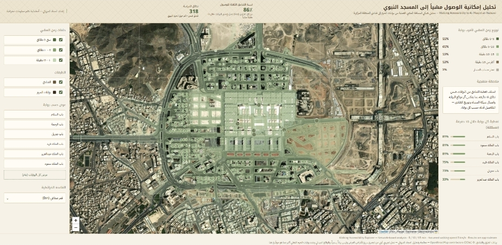
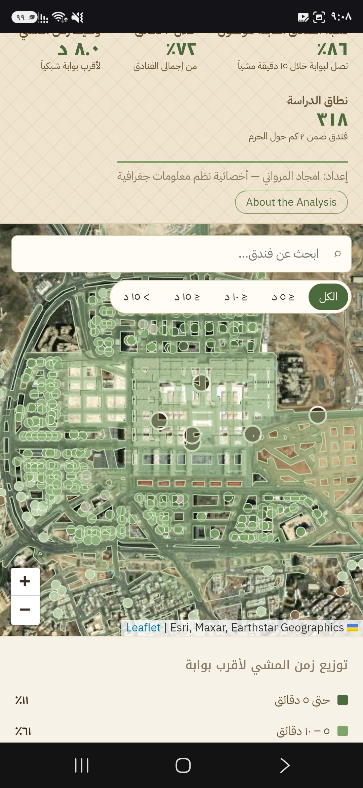

# 🕌 Walking Accessibility to Al-Masjid an-Nabawi

### تحليل إمكانية الوصول مشيًا إلى المسجد النبوي

**A Network-Based GIS Exploration of Madinah's Central Area**

📍 Madinah, Saudi Arabia

[🌐 Live Dashboard](https://jemj208.github.io/GIS-Projects/madinah-haram-accessibility/) · [🧭 Methodology](#-methodology) · [⚠️ Limitations](#️-limitations)

---

## 🌿 عن المشروع

المدينة بالنسبة لي ماهي مجرد مساحة على الخريطة، لكنها مكان أعرفه جداً وأحبه وأستمتع بقراءته مكانيًا.

بدأ هذا المشروع من سؤال بسيط:

**كيف تبدو إمكانية الوصول مشيًا من فنادق المنطقة المركزية إلى المسجد النبوي؟ وهل تتساوى بوابات المسجد في مستوى خدمتها للفنادق المحيطة؟**

بدلًا من قياس المسافة بخط مستقيم، حاولت النظر إلى التجربة كما يعيشها الزائر فعليًا: **من خلال شبكة المشي والمسار الذي يمكن قطعه على الأرض.**

جمعت بيانات الفنادق وشبكة الطرق، وبنيت شبكة للمشاة، وحللت أقصر المسارات إلى مجموعة مختارة من بوابات المسجد النبوي، ثم حولت النتائج إلى مستكشف Web GIS تفاعلي يسمح باستكشاف الفنادق، أزمنة المشي، المسارات، ونطاق خدمة كل بوابة.

هذا المشروع **تجربة GIS شخصية مستقلة** أستكشف من خلالها كيف يمكن للتحليل المكاني أن يقرأ مدينتي من زاوية إنسانية مرتبطة بالحركة والوصول وتجربة الزائر.

**— أمجاد عبدالله المرواني**  
*GIS Specialist · Spatial Analyst · Cartographer*

---

## ✦ Project at a Glance

| | |
|---|---|
| 🏨 **Hotels** | 318 hotels within approximately 2 km |
| 🛣️ **Network** | 2,846 pedestrian network segments |
| 🕌 **Gates** | 6 selected gates |
| 🚶 **Walking Speed** | 5 km/h |
| ⏱️ **Accessibility Zones** | 5 · 10 · 15 minutes |
| 🧭 **Routing** | Network-based shortest path |
| 🌐 **Output** | Interactive Web GIS dashboard |

---

## 🗺️ Dashboard

### [🌐 Explore the Live Dashboard](https://jemj208.github.io/GIS-Projects/madinah-haram-accessibility/)

*Search a hotel · Explore its walking route · Filter by travel time · Compare gate coverage*

---

## 💡 The Spatial Question

Hotels surrounding Al-Masjid an-Nabawi may appear geographically close to the mosque, but **proximity does not necessarily equal pedestrian accessibility**.

Street connectivity, available pedestrian paths, and the location of mosque gates influence the actual route a visitor may need to walk.

This project therefore focuses on **network distance rather than straight-line distance**.

> **How does the pedestrian network shape accessibility between hotels and Al-Masjid an-Nabawi?**

---

## 🧭 Methodology

The analytical workflow follows four main stages:

### `01 · DATA` → `02 · NETWORK` → `03 · ANALYSIS` → `04 · INTERACTIVE WEB GIS`

### 01 · Data

The study uses:

- Hotel locations from **OpenStreetMap**
- Walkable road and street data from **OpenStreetMap**
- Six selected gates of Al-Masjid an-Nabawi
- A study area extending approximately **2 km** around the mosque

### 02 · Pedestrian Network

The street data was prepared as a pedestrian network after excluding unsuitable high-speed road segments.

The resulting network contains approximately **2,846 segments**.

### 03 · Network Analysis

The pedestrian network was represented as a graph.

**Dijkstra's shortest-path algorithm** was used to calculate network-based routes from the selected mosque gates.

Each hotel was associated with its nearest accessible gate through the pedestrian network.

Network distance was then converted into estimated walking time using an assumed walking speed of:

**5 km/h**

Accessibility was summarized using:

- **≤ 5 minutes**
- **5–10 minutes**
- **10–15 minutes**
- **> 15 minutes**

### 04 · Interactive Exploration

The analytical results were transformed into an interactive Web GIS dashboard, allowing the analysis to be explored spatially rather than presented only as static maps.

---

## ✨ Interactive Features

The dashboard includes:

- 🔎 **Hotel Search** — locate and explore individual hotels
- 🚶 **Walking Routes** — display the network route toward the nearest selected gate
- ⏱️ **Time Filters** — explore hotels by estimated walking time
- 🕌 **Gate Exploration** — examine the spatial coverage associated with individual gates
- 🌿 **Walking-Time Zones** — toggle 5, 10 and 15-minute accessibility areas
- 🗺️ **Layer Controls** — show or hide hotels and gates
- 🌍 **Multiple Basemaps** — switch between light, OSM, dark and satellite views
- 📊 **Accessibility Indicators** — explore walking-time distribution and gate coverage

---

## 📱 Mobile Experience

The dashboard was designed to adapt to smaller screens, allowing the spatial analysis to remain explorable from mobile devices.

  

The responsive interface reorganizes the map, indicators and controls for mobile exploration while preserving the core analytical functionality.

### 🎥 Mobile Demo

A short mobile walkthrough demonstrates the interactive experience:

**Hotel search → route exploration → walking-time filtering → gate analysis**

  <a href="assets/dashboard-mobile-video.mp4">
    ▶️ <strong>Watch the Mobile Dashboard Demo</strong>
  </a>

---

## 🔍 What This Project Explores

This project is not intended only to answer:

> *"How far is this hotel from the mosque?"*

It explores a broader GIS idea:

### **Accessibility is shaped by networks, not simply by proximity.**

Two hotels with similar straight-line distances may have different pedestrian experiences depending on network connectivity and the gate through which the mosque is accessed.

This makes network analysis useful for understanding movement within dense urban environments such as Madinah's central area.

---

## 🛠️ Tech & Methods

### GIS & Spatial Analysis

`Network Analysis` · `Shortest Path` · `Accessibility Analysis` · `Spatial Data Preparation`

### Web GIS

`Leaflet` · `HTML` · `CSS` · `JavaScript`

### Data

`OpenStreetMap`

### Algorithm

`Dijkstra Shortest Path`

---

## ⚠️ Limitations

This is an **independent experimental GIS project developed for exploration and portfolio purposes**. It is not an official accessibility study.

Important limitations include:

- Walking time assumes a constant speed of **5 km/h**.
- Crowd density and seasonal congestion are not modeled.
- Gate opening times and temporary access restrictions are not considered.
- Elevation differences are not incorporated.
- Open pedestrian spaces immediately surrounding the mosque are not fully represented as part of the street network.
- Only **six selected gates** are included; Al-Masjid an-Nabawi has additional entrances.
- The location used for Bab Jibreel is approximate.
- Hotels that could not be connected reliably to the pedestrian network are treated as network/data limitations rather than as an accessibility category.

Results should therefore be interpreted as **approximate analytical estimates**, not official walking guidance.

---

## 🌙 Why Madinah?

For me, GIS becomes most meaningful when spatial analysis connects with places that carry meaning.

Madinah is my city, and this project gave me an opportunity to combine **spatial analysis, urban movement, cartography, and interactive mapping** around a place I know personally.

It is also part of a broader goal in my work:

> **Turning spatial data into something people can explore, understand, and use.**

---

### 🕌 Made in Madinah

**Amjad Abdullah Al-Marwani**

*GIS Specialist · Spatial Analyst · Cartographer*

`Spatial Analysis` · `GIS Automation` · `Remote Sensing` · `Interactive Mapping`

### 🌿 From Madinah, with maps.

